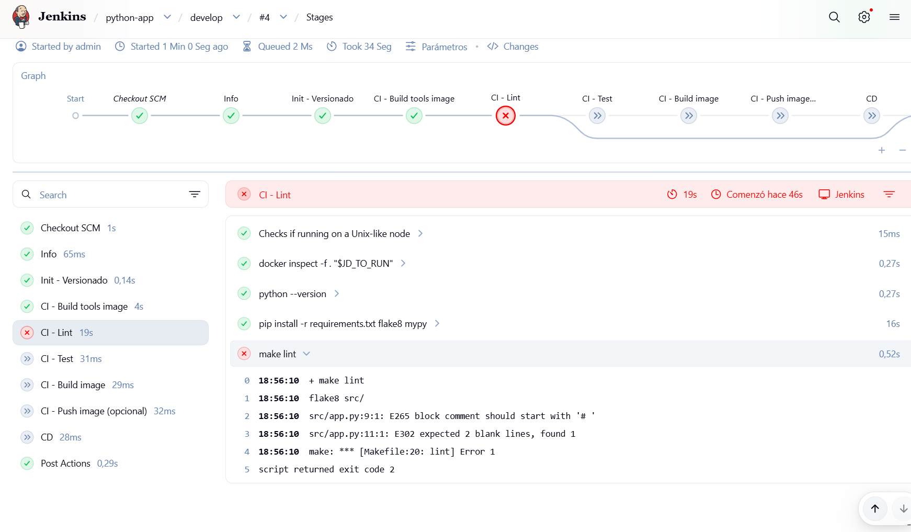

# Práctica 2 - Pipelines CI/CD en Jenkins con Docker y Groovy (Guiada)

En esta práctica aprenderás a construir un pipeline CI/CD en Jenkins de forma incremental, partiendo de un Jenkinsfile “dummy” y mejorándolo paso a paso. El objetivo no es “copiar y pegar una solución”, sino montar un puzle y entender cada pieza del Jenkinsfile.

## Nota importante (leer antes)
En esta práctica hemos ajustado la lista de plugins. Si ya tenías Jenkins levantado con un volumen persistente, **debes reinstalar Jenkins o borrar el volumen** para que el conjunto de plugins se aplique limpio. Si no, pueden quedarse plugins antiguos y aparecer errores de dependencias.

## Repos relacionados y ramas
- Repo Python (base `feat/base`): https://github.com/contreras-adr/devops-training-python-app/tree/feat/base
- Repo Java (base `feat/base`): https://github.com/contreras-adr/devops-training-java-app/tree/feat/base
- Repo IaC/DevOps (base `feat/base`): https://github.com/contreras-adr/devops-training-iac-devops/tree/feat/base

## Referencias (para consultar cuando te atasques)
- Pipeline Jenkins (conceptos): https://www.jenkins.io/doc/book/pipeline/
- Sintaxis Declarative Pipeline: https://www.jenkins.io/doc/book/pipeline/syntax/
- Uso de Docker en Pipeline: https://www.jenkins.io/doc/book/pipeline/docker/
- Shared Libraries: https://www.jenkins.io/doc/book/pipeline/shared-libraries/
- Groovy (documentación): https://groovy-lang.org/documentation.html

## Prerrequisitos
- Jenkins instalado en local con los plugins mínimos (Práctica 1).
- En Jenkins existe un Multi-branch Pipeline para **cada repo** (Python y Java).
- Cada pipeline apunta al fichero `devops/jenkinsfile` (al principio es “dummy”).
- Jenkins puede ejecutar Docker (Docker daemon accesible desde Jenkins; en este curso normalmente via DinD).

## Credenciales Jenkins (importante)
Antes de ejecutar los stages opcionales de publicación, crea estas credenciales en Jenkins:

Ruta:
- `Manage Jenkins -> Credentials -> System -> Global credentials (unrestricted) -> Add Credentials`

Credenciales esperadas por ID:
- `local-registry-creds`
  - Tipo: `Username with password`
  - Uso: login y push al Docker Registry local (`local-registry:5000`) en el ejercicio 7 opcional.
  - Valores (laboratorio):
    - `ID`: `local-registry-creds`
    - `Username`: `registry-user`
    - `Password`: `registry-pass`
    - `Description`: `Local Docker Registry credentials`
- `artifactory-creds` (solo Java opcional)
  - Tipo: `Username with password` (o token según tu configuración)
  - Uso: subida del `.jar` a Artifactory en el ejercicio 9 opcional.
  - Valores (laboratorio):
    - `ID`: `artifactory-creds`
    - `Username`: `admin`
    - `Password`: `password` (o la contraseña actual de `admin` si ya fue cambiada)
    - `Description`: `Local Artifactory credentials`
  - Recomendación:
    - Crear un usuario técnico dedicado en Artifactory (por ejemplo `ci-user`) y usar ese usuario en lugar de `admin`.

Nota:
- El `ID` debe coincidir exactamente con el usado en el Jenkinsfile.
- Si no existe la credencial, Jenkins fallará con errores del tipo:
  - `Could not find credentials entry with ID 'local-registry-creds'`
- El `local-registry` del laboratorio (servicio `registry:2` en `docker-compose.yml`) está configurado **sin autenticación** por defecto.
- Aunque el registry sea abierto, si tu Jenkinsfile usa `withCredentials(credentialsId: 'local-registry-creds', ...)`, Jenkins exige que esa credencial exista.
- Para no bloquear el pipeline en laboratorio:
  - Crea `local-registry-creds` con valores dummy (`registry-user` / `registry-pass`), o
  - Adapta el Jenkinsfile para omitir `docker login` cuando no haya auth en el registry.

Captura de referencia (crear credenciales en Jenkins):


## Estrategia Gitflow simulada (entornos DEV y PRO)
En esta práctica vamos a simular que existen **2 entornos**:
- **DEV**: se despliega desde la rama `develop`
- **PRO**: se despliega desde la rama `master`

Y trabajaremos el desarrollo en una rama feature:
- `feat/training-2-piplines-ci-cd-jenkins`

Regla principal del curso:
- **CI** se ejecuta en cualquier rama (feature/develop/master).
- **CD** se ejecuta si:
  - `RUN_CD=true` (en cualquier rama), **o**
  - la rama es `develop` o `master` (aunque `RUN_CD=false`).

## Qué vas a construir (resultado final)

### Pipeline Python
- CI
  - Ejecutar `make lint` en un contenedor `python:3.6-slim`.
  - Ejecutar tests unitarios en un contenedor `python:3.6-slim`.
  - Construir la imagen Docker de la app (sin push).
- CD
  - Levantar BBDD + App con Docker Compose en el agente de Jenkins (no existen entornos externos aún).
  - Ejecutar un test end-to-end llamando al endpoint expuesto por la API.
  - Limpiar recursos con `docker compose down --volumes`.

### Pipeline Java
- CI
  - Ejecutar `make lint` en un contenedor `maven:3.8.6-openjdk-11-slim`.
  - Ejecutar `make test` en un contenedor `maven:3.8.6-openjdk-11-slim`.
  - Construir la imagen Docker de la app (sin push).
- CD
  - Levantar BBDD + App (o solo App si el repo no tiene BBDD) con Docker Compose en el agente de Jenkins.
  - Ejecutar un test end-to-end llamando al endpoint expuesto por la API.
  - Limpiar recursos con `docker compose down --volumes`.

## Cómo se trabaja en esta práctica (modo guiado)
- Partimos de un Jenkinsfile inicial (dummy) y lo vamos evolucionando.
- En cada ejercicio:
  1) Modificas `devops/jenkinsfile`
  2) Ejecutas el pipeline
  3) Verificas el resultado (logs + salida)
  4) Pasas al siguiente paso

## Punto de partida: Jenkinsfile dummy
En cada repo tienes un fichero de referencia:
- `devops/Jenkinsfile-dummy` (plantilla inicial)
- `devops/Jenkinsfile-template` (ejemplo de referencia)

Tu fichero “real” para Jenkins siempre es:
- `devops/Jenkinsfile`

Ejercicio 0 (setup):
- Copia el contenido de `devops/Jenkinsfile-dummy` a `devops/Jenkinsfile`.
- Confirma que Jenkins ejecuta el pipeline y que al menos hace un stage sencillo.

### Ejercicio 0.1 - Crear ramas (Gitflow simulado)
Objetivo: preparar el repositorio para simular entornos.

Tarea (en **cada repo** de proyecto: Python y Java):
1) Crea la rama `develop` (simula el entorno DEV).
2) Crea la rama `feat/training-2-piplines-ci-cd-jenkins` a partir de `develop` (rama de trabajo).

Notas:
- En un Multi-branch Pipeline, Jenkins detecta ramas automaticamente y ejecuta el Jenkinsfile de esa rama.
- En un Multi-branch Pipeline, Jenkins detecta ramas automáticamente y ejecuta el Jenkinsfile de esa rama.
- Si tu repo no tiene `master` (por ejemplo usa `main`), crea `master` para la práctica o adapta la regla a `main`.

## Ejercicios (montando el puzzle)

### Ejercicio 1 - Entender `pipeline`, `agent` y `stages`
Objetivo: identificar las 3 piezas básicas.
- `pipeline { ... }`: bloque principal
- `agent { ... }`: dónde se ejecuta (máquina/contenedor)
- `stages { stage('...') { steps { ... } } }`: fases del pipeline

Tarea:
- En `devops/jenkinsfile`, añade un stage nuevo llamado `Info` que ejecute:
  - `echo "Job: ${env.JOB_NAME}"`
  - `echo "Build: ${env.BUILD_NUMBER}"`

Pista:
- Necesitas `steps { ... }` y `sh` o `echo`.

### Ejercicio 2 - Usar Docker como agente en un stage (ejemplo “Test”)
Objetivo: ejecutar un stage dentro de un contenedor.

Ejemplo (Java):
```groovy
stage('Test') {
  agent {
    docker {
      image 'maven:3.8.6-openjdk-11-slim'
    }
  }
  steps {
    sh 'mvn test'
  }
}
```

Tarea:
- Java: crea/ajusta el stage `Test` para ejecutar `mvn test` dentro del contenedor Maven.
- Python: crea/ajusta el stage `Test` para ejecutar `pytest` dentro de `python:3.6-slim`.

Checklist:
- En los logs debe verse la descarga del contenedor (la primera vez) y la ejecución del comando.

### Ejercicio 3 - Separar CI en dos stages (Lint/Test)
Objetivo: entender por qué dividimos stages: feedback rápido y fallos más claros.

Java:
- Crea un stage `Lint` que ejecute `make lint` en `maven:3.8.6-openjdk-11-slim`.
- Mantén `Test` para `make test`.

Python:
- Crea una imagen de CI (`devops/ci.Dockerfile`) para tener `make` disponible en los stages.
- Crea un stage `Lint` que ejecute `make lint` en `python:3.6-slim`.
- Mantén `Test` para tests unitarios (por ejemplo, `pytest -q`).
- Usa esa imagen de CI construida en ambos stages (`Lint` y `Test`).
- Instala también en el contenedor las dependencias de lint que no están en `requirements.txt`:
  - `pip install -r requirements.txt flake8 mypy`

Nota docente (Python):
- La primera ejecución del stage `Lint` puede fallar por formato (`black --check`).
- Captura de referencia del error:



- El flujo esperado para corregirlo es:
  1) crear una rama `fix/lint`
  2) ejecutar `make reformat` en local
  3) hacer commit y push de los cambios de formato
  4) abrir PR `fix/lint -> develop` y mergear
  5) Revisar nueva ejecución de Jenkins en `develop`

### Ejercicio 3.1 - Corregir Lint con rama fix y PR a `develop`
Objetivo: aplicar Gitflow cuando falla calidad en CI sin romper la rama de integración.

Tarea (Python):
1) Crea la rama `fix/lint` desde tu rama de trabajo.
2) Corrige formato y vuelve a ejecutar lint en local (`make reformat` + `make lint`).
3) Sube la rama `fix/lint` al remoto.
4) Abre una PR hacia `develop`.
5) Haz merge de la PR y verifica que Jenkins pasa en `develop`.

Qué es un Makefile (explicación corta):
- Un Makefile es un “lanzador de tareas” con objetivos (targets).
- Ejecutas un target con `make <target>`, por ejemplo: `make test`.

### Ejercicio 4 - Introducción a Groovy: crear una función reutilizable
Objetivo: evitar duplicar el mismo bloque de Docker en cada stage.

Tarea:
- En la parte superior del Jenkinsfile (antes de `pipeline { ... }`), crea una función Groovy:
  - `runInDocker(String image, Closure body)`
- Refactoriza los stages `Lint` y `Test` para usar `runInDocker(...)`.

Pista:
- Dentro de la función, usa `docker.image(image).inside { ... }`.

### Ejercicio 5 - Construir la imagen Docker en CI
Objetivo: convertir el repo en un artefacto desplegable (imagen).

Tarea (Python y Java):
- Añade un stage `Build image` que ejecute un `docker.build(...)` usando el Dockerfile del repo:
  - Python: `-f devops/Dockerfile .`
  - Java: `--build-arg VERSION=... -f devops/Dockerfile .`

Validación:
- Debe verse en logs el build y el tag final.

### Ejercicio 6 - CD con Docker Compose (up -> e2e -> down)
Objetivo: simular un “despliegue” local (aún no hay entornos externos).

Tarea:
- Crea un stage `CD` que haga:
  1) `docker compose up -d`
  2) espera corta (`sleep 5`)
  3) mostrar logs del contenedor principal (`docker compose logs <servicio>`)
  4) `docker compose down --volumes` (siempre, incluso si falla el stage)

Pista:
- Usa `post { always { ... } }` dentro del stage o `try/finally` en un bloque `script`.

Nota:
- En esta práctica no hacemos `curl` al endpoint desde Jenkins. Solo mostramos logs del contenedor para validar el despliegue local.

### Ejercicio 6.1 - Ejecutar CD por rama o parámetro
Objetivo: aprender a combinar condiciones de rama y parámetros.

Tarea:
- Modifica el stage `CD` para que se ejecute si:
  - `RUN_CD=true`, o
  - la rama es `develop` o `master`.

Pista (Declarative Pipeline):
```groovy
stage('CD') {
  when {
    anyOf {
      expression { return params.RUN_CD }
      branch 'develop'
      branch 'master'
    }
  }
  steps {
    echo "CD habilitado: RUN_CD=${params.RUN_CD}, branch=${env.BRANCH_NAME}"
  }
}
```

### Ejercicio 6.2 - Simular despliegue a DEV/PRO
Objetivo: “pintar” el entorno de despliegue según la rama y dejarlo reflejado en logs.

Tarea:
- Dentro del stage `CD`, define una variable `DEPLOY_ENV`:
  - Si `BRANCH_NAME == 'master'` -> `PRO`
  - Si no -> `DEV`
- Imprime un mensaje del estilo: `Deploying to <DEPLOY_ENV>`.

Pista:
```groovy
script {
  env.DEPLOY_ENV = (env.BRANCH_NAME == 'master') ? 'PRO' : 'DEV'
  echo "Deploying to ${env.DEPLOY_ENV}"
}
```

Extra (opcional, simulación técnica):
- Usa un nombre de proyecto distinto para Docker Compose según el entorno (solo cambia los nombres de recursos):
  - DEV: `docker compose -p dev up -d`
  - PRO: `docker compose -p pro up -d`

### Ejercicio 6.3 - Parámetros (build parameters) para activar/desactivar comportamiento
Objetivo: aprender a definir parámetros en Jenkins y usarlos para controlar la ejecución del pipeline.

Tarea:
- Añade un parámetro booleano llamado `RUN_CD` (por defecto `false`).
- Modifica el stage `CD` para que:
  - si `RUN_CD=true`, ejecute en cualquier rama;
  - si `RUN_CD=false`, solo ejecute en `develop`/`master`.

Pista:
```groovy
parameters {
  booleanParam(name: 'RUN_CD', defaultValue: false, description: 'Ejecutar CD')
}

stage('CD') {
  when {
    anyOf {
      expression { return params.RUN_CD }
      branch 'develop'
      branch 'master'
    }
  }
  steps {
    echo "CD habilitado: RUN_CD=${params.RUN_CD}, branch=${env.BRANCH_NAME}"
  }
}
```

### Ejercicio 6.4 - Variables de entorno (`environment`) y su uso en `sh`
Objetivo: entender cómo definir variables de entorno y reutilizarlas en diferentes stages.

Tarea:
- Define variables en el bloque `environment`, por ejemplo:
  - `IMAGE_NAME`
  - `APP_URL`
- Úsalas en comandos `sh` y en `echo`.

Pista:
```groovy
environment {
  IMAGE_NAME = "mi-imagen:${BUILD_NUMBER}"
  APP_URL = "http://localhost:5001/"
}

steps {
  echo "Imagen: ${env.IMAGE_NAME}"
  sh "echo URL=${APP_URL}"
}
```

### Ejercicio 6.5 - Hooks `post` (always/success/failure) y limpieza de recursos
Objetivo: aprender a ejecutar acciones de limpieza y reporting al final del pipeline o de un stage.

Tarea:
- Añade un bloque `post` al pipeline (o al stage `CD`) con:
  - `always`: borrar recursos temporales (por ejemplo `docker compose down --volumes` y/o borrar una imagen)
  - `success`: imprimir `SUCCESS`
  - `failure`: imprimir `FAILURE` y mostrar logs útiles (`docker compose logs`)

Ejemplo:
```groovy
post {
  always {
    // Limpieza: esto debe ejecutarse tanto si falla como si va bien.
    sh 'docker compose down --volumes || true'
    sh 'docker rmi IMAGE_NAME || true'
  }
  success {
    echo 'SUCCESS'
  }
  failure {
    echo 'FAILURE'
    sh 'docker compose logs || true'
  }
}
```

### Ejercicio 7 (opcional) - Push a un registry privado desde CI
Objetivo: hacer “publish” del artefacto imagen.

Prerrequisito:
- Asegúrate de tener levantado el servicio `registry` en `devops-training-iac-devops/docker-compose.yml`.

Tarea:
- Añade un parámetro booleano `ENABLE_REGISTRY_PUSH`.
- Si está activo:
  - Taggea la imagen con `local-registry:5000/<nombre>:<build>`
  - Autentica con credenciales de Jenkins (`local-registry-creds`)
  - Haz `push()`

Validación (Docker Registry local):
- Comprueba repositorios publicados:
```bash
curl -s http://localhost:5000/v2/_catalog
```

Validación (JAR en Artifactory):
```bash
# Listar el directorio donde Jenkins sube el JAR
curl -u admin:password "http://artifactory:8081/artifactory/libs-release-local/devops-training-java-app/${BUILD_NUMBER}/"

# Verificar un fichero concreto (ajusta el nombre del JAR)
curl -I -u admin:password "http://artifactory:8081/artifactory/libs-release-local/devops-training-java-app/${BUILD_NUMBER}/spring-boot-2-hello-world-${VERSION_JAR}.jar"
```
- Comprueba tags de una imagen concreta:
```bash
curl -s http://localhost:5000/v2/<nombre-imagen>/tags/list
```
- Validación final de consumo:
```bash
docker pull localhost:5000/<nombre-imagen>:<build>
```

### Ejercicio 9 (opcional, Java) - Subir el artefacto (.jar) a Artifactory (sin plugin)
Objetivo: publicar el artefacto Java en un repositorio de artefactos usando un comando sencillo (sin depender del plugin de Artifactory en Jenkins).

Prerrequisitos:
- Asegúrate de tener levantado el servicio `artifactory` en `devops-training-iac-devops/docker-compose.yml`.
- Crea credenciales en Jenkins con ID `artifactory-creds` (usuario/password o token).

Tarea (en el Jenkinsfile de Java, después de `make test`):
- Usa `withCredentials` y `curl` para subir el jar `target/*.jar` a una ruta del estilo:
  - `http://artifactory:8081/artifactory/libs-release-local/devops-training-java-app/<build>/...`

Pista (plantilla):
```groovy
withCredentials([usernamePassword(
  credentialsId: 'artifactory-creds',
  usernameVariable: 'ART_USER',
  passwordVariable: 'ART_PASS'
)]) {
  sh '''
    ART_URL="http://artifactory:8081/artifactory"
    ART_REPO="libs-release-local"
    ART_PATH="devops-training-java-app/${BUILD_NUMBER}"
    JAR_FILE=$(ls target/*.jar | head -n 1)

    curl -u "${ART_USER}:${ART_PASS}" -T "${JAR_FILE}" \
      "${ART_URL}/${ART_REPO}/${ART_PATH}/$(basename ${JAR_FILE})"
  '''
}
```

Validación (Artifactory):
- Si en este ejercicio subes `.jar` (caso base), verifica el path del artefacto:
```bash
curl -u "<usuario>:<password>" \
  "http://localhost:8081/artifactory/api/storage/libs-release-local/devops-training-java-app/<build>"
```

- Si además usas Artifactory como Docker Registry para imágenes, verifica catálogo y tags:
```bash
curl -u "<usuario>:<password>" \
  "http://localhost:8081/artifactory/api/docker/<docker-repo>/v2/_catalog"

curl -u "<usuario>:<password>" \
  "http://localhost:8081/artifactory/api/docker/<docker-repo>/v2/<nombre-imagen>/tags/list"
```

### Ejercicio 10 (opcional) - Refactor final: “mini libreria” para Compose
Objetivo: empaquetar el flujo CD para no repetirlo.

Tarea:
- Crea una función `composeUpTestDown(Map args)` que reciba:
  - `up`, `test`, `down`
- Cambia el stage CD para usar esa función.

### Ejercicio 11 (opcional, Java) - Usar `cd.Dockerfile` en la fase CD
Objetivo: construir una imagen “runtime” en CD usando `devops/cd.Dockerfile`.

Tarea:
- Después de generar el jar en `target/` (con Maven), crea un stage `CD - Build runtime image` que haga:
  - `docker build -f devops/cd.Dockerfile --build-arg VERSION=<version> .`

Nota:
- `cd.Dockerfile` copia el jar desde `./target/` y crea una imagen final con `openjdk:11-jre-slim`.

### Ejercicio 12 (opcional) - Refactor con librería Groovy compartida
Objetivo: sustituir funciones locales del Jenkinsfile por funciones reutilizables desde una librería compartida en el repo IaC.

Contexto:
- Librería del curso: `devops-training-iac-devops/groovy/vars/devopsLib.groovy`
- Funciones disponibles:
  - `runInDocker(String image, Closure body)`
  - `composeUpTestDown(Map args)`
  - `setComposeServiceImage(Map args)`
  - `readVersion(String versionFile = "VERSION")`

Paso a paso: registrar la librería en Jenkins
1) Ir a:
   - `Manage Jenkins -> System -> Global Trusted Pipeline Libraries`
2) En “Global Trusted Pipeline Libraries”, pulsa “Add”.
3) Configura:
   - `Name`: `iac-devops-lib`
   - `Default version`: `feat/base` (o la rama donde tengas la librería)
   - Marca “Allow default version to be overridden” (opcional recomendado)
4) En “Retrieval method”, selecciona:
   - `Modern SCM` -> `Git`
   - URL del repo IaC:
     - `https://github.com/contreras-adr/devops-training-iac-devops.git`
   - Credenciales (si el repo no es público)
5) Define `Library Path`:
   - `groovy` si la librería está en `groovy/vars/devopsLib.groovy`
6) Guarda y vuelve al pipeline.

Captura de referencia (configuración de Global Trusted Pipeline Libraries):


Referencias útiles (Shared Libraries):
- Jenkins Shared Libraries (guía principal): https://www.jenkins.io/doc/book/pipeline/shared-libraries/
- Global Shared Libraries (configuración en Jenkins): https://www.jenkins.io/doc/book/pipeline/shared-libraries/#global-shared-libraries
- Carga dinámica con `library` step: https://www.jenkins.io/doc/book/pipeline/shared-libraries/#loading-libraries-dynamically

Tarea de refactor en cada repo (Python y Java):
- Elimina funciones locales (`runInDocker`, `composeUpTestDown`) del Jenkinsfile.
- Importa la librería al inicio:
```groovy
@Library('iac-devops-lib') _
```
- Sustituye llamadas:
  - `runInDocker(...)` -> `devopsLib.runInDocker(...)`
  - `composeUpTestDown(...)` -> `devopsLib.composeUpTestDown(...)`
- Usa `devopsLib.readVersion('VERSION')` para leer la versión de imagen desde el fichero `VERSION` en la raíz del repo.
- Antes de CD, usa `devopsLib.setComposeServiceImage(...)` para actualizar en `docker-compose.yml` la imagen del servicio de app.

Referencia de plantilla:
- `devops-training-iac-devops/jenkins/Jenkinsfile-template-ejercicio-optional`

## Entregables
- `devops/jenkinsfile` actualizado (nueva versión) en ambos repos.
- En el Jenkinsfile: comentarios breves explicando cada parte (pipeline/agent/stage/steps/post).
- Evidencia en Jenkins: pipeline ejecutado (captura o logs).
