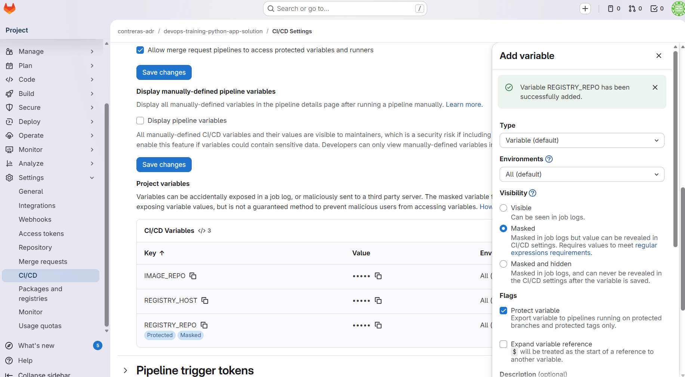

# Práctica 4 - Pipelines CI/CD con GitLab CI/CD (Guiada)

En esta práctica harás lo mismo que en la Práctica 2 (Jenkins) y Práctica 3 (GitHub Actions), pero usando **GitLab CI/CD**.

IMPORTANTE:
- Esta práctica es **opcional**: no es obligatorio crear una cuenta de GitLab ni ejecutar los pipelines.
- Para entregar la práctica, es suficiente con presentar la **solución teórica** (los ficheros `.gitlab-ci.yml` con comentarios/estructura final).

## Prerrequisitos
- Conocer la Práctica 2 (CI/CD por stages, Docker, cleanup, ramas).
- (Opcional) Tener una cuenta de GitLab.com o acceso a un GitLab on-prem.

## Importar y sincronizar repositorios GitLab -> GitHub
Objetivo: trabajar en GitLab y mantener un espejo en GitHub (o viceversa).

### Opción A (simple): dos remotes en local
1) Clona el repo de GitLab y añade el remoto de GitHub:
```bash
git clone <URL_GITLAB>
cd <repo>
git remote add github <URL_GITHUB>
```
2) Sube todo a GitHub:
```bash
git push github --all
git push github --tags
```
3) Para mantener sincronizado, configura un push dual:
```bash
git remote set-url --add --push origin <URL_GITLAB>
git remote set-url --add --push origin <URL_GITHUB>
```
Con esto, cada `git push` enviará cambios a GitLab y GitHub.

### Opción B (recomendada en equipos): GitLab Push Mirror hacia GitHub
Usa la funcionalidad de **Repository Mirroring** en GitLab para empujar cada cambio a GitHub.
Necesitas un **Personal Access Token** de GitHub con permisos de repo.

### Opción C (alternativa): workflow en GitHub que haga pull desde GitLab
Puedes crear un workflow programado en GitHub que haga `git pull` desde GitLab y haga `push` a GitHub.
Útil si GitHub es el “espejo” y GitLab es la fuente de verdad.

## Por qué hay que crear repositorios desde cero en GitLab
En el curso partimos de repositorios en GitHub. Para usar GitLab CI/CD, asumimos que:
- Vas a crear **nuevos repositorios Git en GitLab** (vacíos).
- Vas a copiar el código fuente de los repos actuales (Python/Java) y hacer un primer push.

Esto te obliga a practicar una situación real:
- migración/copia de un repo a otra plataforma
- primera configuración de CI/CD en un repo nuevo

## Cómo crear los repositorios Git en GitLab (paso a paso)
Repite estos pasos para **Python** y **Java**:

1) Crear un proyecto vacío en GitLab
- New project -> Create blank project
- Nombre sugerido:
  - `devops-training-python-app` (o añade sufijo `-gitlab`)
  - `devops-training-java-app` (o añade sufijo `-gitlab`)

2) Inicializar el repo local (si no tienes `.git`)
En el directorio del proyecto:
```bash
git init
git add .
git commit -m "Initial import for GitLab CI"
```

3) Añadir remote de GitLab y hacer push
```bash
git remote add origin <URL_DEL_REPO_GITLAB>
git branch -M master
git push -u origin master
```

Notas:
- Si tu repo usa `main`, adapta el nombre de rama.
- Si quieres simular Gitflow como en Práctica 2/3, crea también `develop`:
  - `git checkout -b develop`
  - `git push -u origin develop`

## Estrategia Gitflow simulada (DEV y PRO)
Simulamos 2 entornos:
- **DEV**: despliegue desde la rama `develop`
- **PRO**: despliegue desde la rama `master`

Reglas:
- **CI** se ejecuta en cualquier rama.
- **CD** solo se ejecuta si la rama es `develop` o `master`.

## Punto de partida: pipeline dummy (010)
En cada repo (Python/Java) crea cuatro ficheros de referencia:
- `.gitlab/gitlab-ci-dummy.yml` (plantilla inicial)
- `.gitlab/gitlab-ci-template.yml` (estructura final / guía, sin “código copiable”)
- `.gitlab/gitlab-ci-template-full.yml` (SaaS en cloud usando servicios nativos de GitLab)
- `.gitlab/gitlab-ci-template-full-local.yml` (runner local con registry/Artifactory locales)

Nota:
- Usa `gitlab-ci-template-full.yml` si el pipeline se ejecuta en GitLab SaaS (registry/package registry nativos).
- Usa `gitlab-ci-template-full-local.yml` si ejecutas el pipeline con runner local y servicios on-prem.

El fichero real que ejecuta GitLab CI/CD es:
- `.gitlab-ci.yml`

Ejercicio 0 (setup):
1) Copia `.gitlab/gitlab-ci-dummy.yml` a `.gitlab-ci.yml`
2) Haz commit y push
3) (Si ejecutas la práctica) revisa en GitLab:
   - CI/CD -> Pipelines

## Ejercicios (montando el puzle)

### Ejercicio 1 - Estructura mínima: `stages` y un job
Objetivo: entender el YAML mínimo de GitLab CI/CD.

Tarea:
- Define `stages: [ci]`
- Crea un job `ci:info` que imprima variables (rama/commit).

Referencia:
- https://docs.gitlab.com/ee/ci/yaml/

### Ejercicio 2 - Variables: `variables:` y variables predefinidas
Objetivo: aprender a definir variables y usar las predefinidas de GitLab.

Tarea:
- Define variables globales:
  - `IMAGE_REPO`
  - `REGISTRY_HOST`
  - `REGISTRY_REPO`
  - `COMPOSE_SERVICE`
- Imprime en logs:
  - `$CI_COMMIT_BRANCH`
  - `$CI_COMMIT_SHA`

Referencia:
- Variables predefinidas: https://docs.gitlab.com/ee/ci/variables/predefined_variables.html

### Ejercicio 3 - CI con contenedores (Docker como agente)
Objetivo: ejecutar jobs en contenedores (similar a Jenkins agent docker / GHA container jobs).

Tarea:
- Construye una imagen de CI desde `devops/ci.Dockerfile` (Python/Java).
- Ejecuta `make lint` y `make test` dentro de esa imagen con `docker run`.

Nota:
- Para esto necesitas Docker-in-Docker (`services: [docker:dind]`) o un runner con Docker disponible.

### Ejercicio 4 - Build de imagen Docker en CI
Objetivo: construir la imagen Docker del repo.

Tarea:
- Añade un job `ci:build` que ejecute `docker build`.

Nota:
- Para construir imágenes con Docker dentro de GitLab CI normalmente necesitas:
  - GitLab Runner con Docker executor, y/o
  - Docker-in-Docker (`services: [docker:dind]`)

Referencia:
- https://docs.gitlab.com/ee/ci/docker/using_docker_build.html

### Ejercicio 5 - Condiciones por rama: ejecutar CD solo en `develop/master`
Objetivo: simular despliegue por entornos con reglas.

Tarea:
- Crea un stage `cd` y un job `cd:deploy` que solo ejecute cuando la rama sea:
  - `develop` o `master`
  - o cuando `RUN_CD == "true"` (variable manual de pipeline)
- Asigna `environment` dinámico:
  - `master` -> `PRO`
  - resto -> `DEV`
  - (Pista: usa `rules:` con `variables:` y `environment: name: $ENV_NAME`)

Pista:
- Usa `rules:` con `if:`.

Referencia:
- https://docs.gitlab.com/ee/ci/yaml/#rules

### Ejercicio 6 - Simulación de despliegue con Docker Compose + cleanup
Objetivo: simular CD (up -> e2e -> down).

Tarea:
- En `cd:deploy`, ejecuta:
  - `docker compose up -d`
  - mostrar logs del contenedor principal
  - cleanup (siempre) con `after_script:`

Nota importante:
- Solución correcta (real): CD debería **usar la imagen publicada en el registry** (docker pull).
- En runners GitLab shared, el registry local no está disponible: se **simula** con build local.
- Esto mantiene CI y CD asíncronos, pero el deploy consume una imagen reconstruida localmente.
  Si usas runner self-hosted con acceso al registry, sustituye build por pull.

Referencia:
- `after_script`: https://docs.gitlab.com/ee/ci/yaml/#after_script

## Gestión de variables y secretos en GitLab
Objetivo: entender dónde se guardan y cómo se protegen.

Dónde:
- Settings -> CI/CD -> Variables



Recomendación:
- Usa variables “Masked” para secretos.
- Usa variables “Protected” para que solo se expongan en ramas protegidas (por ejemplo `master`).
- Usa **Environment scope** para separar DEV/PRO (por ejemplo `DEV` y `PRO`).

Importante:
- Las variables/secrets son **por proyecto** en GitLab. Debes crearlas en **cada repo** (Python y Java) para que los pipelines funcionen.

Referencia:
- https://docs.gitlab.com/ee/ci/variables/

### Variables necesarias (por proyecto)
Estas variables/secrets son **por proyecto**. Debes crearlas en **cada repo** (Python y Java).

#### SaaS (GitLab Container/Package Registry)
Python (`.gitlab-ci-saas.yml`):
- `IMAGE_REPO` (ej. `contrerasadr/devops-training-python-app`)
- `ENABLE_REGISTRY_PUSH` (`true|false`)
- `RUN_CD` (`true|false`)

Java (`.gitlab-ci-saas.yml`):
- `IMAGE_REPO` (ej. `scalian_training-java-hello-world`)
- `ENABLE_REGISTRY_PUSH` (`true|false`)
- `ENABLE_PACKAGE_UPLOAD` (`true|false`)
- `RUN_CD` (`true|false`)

Notas:
- No necesitas `REGISTRY_*` ni `ARTIFACTORY_*` en SaaS.
- GitLab expone `CI_REGISTRY`, `CI_REGISTRY_USER`, `CI_REGISTRY_PASSWORD` y `CI_JOB_TOKEN` automáticamente.

#### Local (runner local + servicios on‑prem)
Python (`.gitlab-ci-local.yml`):
- `IMAGE_REPO`
- `REGISTRY_HOST` (ej. `local-registry:5000`)
- `REGISTRY_REPO`
- `REGISTRY_USER`, `REGISTRY_PASSWORD`
- `ENABLE_REGISTRY_PUSH` (`true|false`)
- `RUN_CD` (`true|false`)

Java (`.gitlab-ci-local.yml`):
- `IMAGE_REPO`
- `REGISTRY_HOST` (ej. `local-registry:5000`)
- `REGISTRY_REPO`
- `REGISTRY_USER`, `REGISTRY_PASSWORD`
- `ARTIFACTORY_URL` (ej. `http://artifactory:8081/artifactory`)
- `ARTIFACTORY_REPO` (ej. `libs-release-local`)
- `ARTIFACTORY_USER`, `ARTIFACTORY_PASSWORD`
- `ENABLE_REGISTRY_PUSH` (`true|false`)
- `ENABLE_ARTIFACTORY_UPLOAD` (`true|false`)
- `RUN_CD` (`true|false`)

## Opcionales

### Opcional A - Push a un registry
Objetivo: publicar la imagen construida en un registry.

Notas:
- En GitLab, el registry más directo es el **Container Registry** del propio GitLab (servicio nativo).
- GitLab también ofrece **Package Registry** para binarios (por ejemplo JARs).
- Si usas un registry local, necesitas runner self-hosted en tu red.

### Opcional B (Java) - Subir el `.jar` a Artifactory con `curl`
Igual que en Práctica 2/3, usando variables/secrets de GitLab.

### Opcional C - Librería común (include)
Objetivo: reutilizar bloques de pipeline entre Python y Java.

Idea:
- Crear un fichero común en IaC, por ejemplo `.gitlab/ci-common.yml`
- Incluirlo en `.gitlab-ci.yml` con `include:`
- Usar `extends:` y anchors para evitar duplicación

### Opcional D - Usar servicios nativos de GitLab (SaaS)
Objetivo: usar **GitLab Container Registry** y **Package Registry** en lugar de servicios locales.

Qué cambia:
- Container Registry sustituye a `local-registry`.
- Package Registry sustituye a Artifactory para subir el `.jar`.
- Esto solo funciona si el pipeline corre en GitLab SaaS o en GitLab con acceso al registry del propio GitLab.

## GitLab Runners (igual que el runner self-hosted de GitHub Actions)
Un **GitLab Runner** es el componente que ejecuta los jobs de CI/CD. Sin runner, GitLab no puede correr tu pipeline.

Tipos comunes:
- **Shared runners** (GitLab.com): disponibles si GitLab los ofrece para tu plan/proyecto.
- **Specific runners** (self-hosted): los instalas tú en tu máquina/VM/red (ideal para conectividad on-prem).

Ventajas de usar runners self-hosted en el curso/empresa
- **Personalización**: instalas herramientas específicas (docker compose, CLIs, SDKs).
- **Conectividad on-prem**: acceso a servicios internos (registry, Artifactory, SonarQube, BBDD, etc.).
- **Seguridad**: control de egress/ingress y posibilidad de aislar runners por proyecto.
- **Rendimiento/caché**: caches persistentes (Maven/pip/Docker layers) para builds más rápidos.
- **Cumplimiento**: integración con redes segregadas, proxies, políticas internas.

<!--
Nota: en este curso NO trabajaremos con SonarQube en GitLab CI/CD.
Dejamos la referencia como ejemplo por si quieres incluirlo en tu estrategia.
-->

Notas de seguridad:
- Si usas Docker executor y montas `/var/run/docker.sock`, el job tiene mucho poder sobre el host Docker.
- En entornos reales: usar máquinas dedicadas, aislar runners, rotar tokens y aplicar hardening.

## Ejercicio final (opcional) - Desplegar un GitLab Runner en local con Docker Compose
Objetivo: ejecutar pipelines desde tu máquina/red para tener conectividad con herramientas on-prem (registry/Artifactory).

### Paso 1 - Crear/obtener el token de registro del runner
En GitLab (UI):
- Settings -> CI/CD -> Runners
- En “Set up a specific Runner manually” copia:
  - URL de GitLab (por ejemplo `https://gitlab.com/` o tu GitLab on-prem)
  - Token de registro (registration token)

### Paso 2 - Usar el runner ya incluido en el stack IaC
En `devops-training-iac-devops/docker-compose.yml` ya existe el servicio `gitlab-runner` con perfil opcional `gitlab-runner`.
Ese servicio:
- registra el runner automáticamente al arrancar (si no existe `config.toml`),
- usa executor Docker,
- monta `/var/run/docker.sock` para jobs con Docker.

Variables necesarias:
- `GITLAB_URL` (ej. `https://gitlab.com`)
- `GITLAB_REGISTRATION_TOKEN`
- `GITLAB_RUNNER_NAME` (opcional)
- `GITLAB_RUNNER_TAGS` (opcional, recomendado `local,docker`)
- `GITLAB_DOCKER_IMAGE` (opcional, default `docker:27`)

Plantilla incluida:
- `devops-training-iac-devops/.env.gitlab-runner.example`

### Paso 3 - Arrancar el runner desde Docker Compose
Desde `devops-training-iac-devops/`:
```bash
cp .env.gitlab-runner.example .env.gitlab-runner
# Edita .env.gitlab-runner con valores reales
docker compose --env-file .env.gitlab-runner --profile gitlab-runner up -d gitlab-runner
docker compose --env-file .env.gitlab-runner logs -f gitlab-runner
```

### Paso 4 - Usar el runner en `.gitlab-ci.yml` (tags)
Cuando registras el runner puedes asignar **tags** (por ejemplo `local`, `docker`, `onprem`).

En tu job:
```yaml
ci:build:
  stage: ci
  tags: [local, docker]
  image: docker:27
  services:
    - docker:27-dind
  script:
    - echo "TODO: docker build ..."
```

Así fuerzas a que el job se ejecute en tu runner local (con conectividad a `local-registry` y `artifactory`).

### Paso 5 - Conectividad con registry/Artifactory
Si levantas registry/Artifactory en el stack IaC y el runner está en la misma red Docker (`devops_training_net`), tus jobs podrán acceder a:
- `local-registry:5000`
- `artifactory:8081`

Si usas GitLab.com con runners compartidos, NO tendrás acceso a esos hosts internos.

Referencias:
- GitLab Runner: https://docs.gitlab.com/runner/
- Install/Run with Docker: https://docs.gitlab.com/runner/install/docker.html
- Executors (docker): https://docs.gitlab.com/runner/executors/docker.html

## Entregables (opcional ejecutar)
- `.gitlab-ci.yml` en ambos repos (Python/Java) con:
  - stages CI y CD
  - variables y reglas por rama
  - cleanup con `after_script`
- Alternativamente (si no ejecutas):
  - `.gitlab/gitlab-ci-dummy.yml`, `.gitlab/gitlab-ci-template.yml`,
    `.gitlab/gitlab-ci-template-full.yml` y `.gitlab/gitlab-ci-template-full-local.yml`
    + `.gitlab-ci.yml` con la estructura final comentada

Como referencia de solución final existen dos variantes:
- `.gitlab-ci-saas.yml` (SaaS con registries nativos)
- `.gitlab-ci-local.yml` (runner local con servicios locales)
Renombra el fichero que quieras usar a `.gitlab-ci.yml`.
