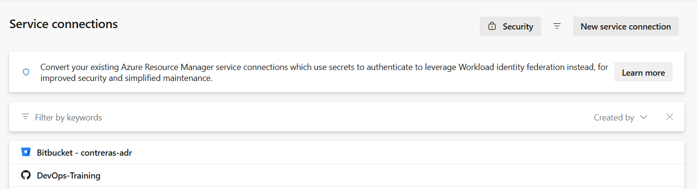
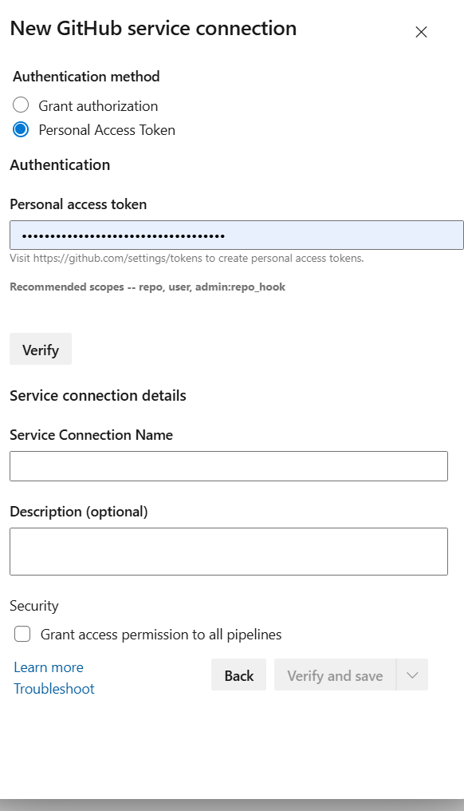

# Práctica 5 - Pipelines CI/CD con Azure DevOps (Guiada)

En esta práctica hacemos la misma estrategia funcional que en la Práctica 4 (GitLab), pero en **Azure DevOps Pipelines**.

Objetivo:
- Mantener la misma lógica CI/CD en dos variantes:
  - **SaaS**: Docker Hub + **Azure Artifacts** (servicio nativo de Azure DevOps).
  - **Local**: agente self-hosted (pool local) + `local-registry` + Artifactory local.

IMPORTANTE:
- Esta práctica es **opcional**: no es obligatorio ejecutarla en Azure.
- Para entrega teórica, basta con dejar los YAML completos y documentados.

## Prerrequisitos
- Haber completado la lógica de Práctica 2/3/4 (CI por stages, CD condicional, cleanup).
- Organización/proyecto en Azure DevOps.
- Repos en GitHub del curso (Python y Java) conectados a Azure DevOps.
- (Opcional local) Pool self-hosted con Docker/Docker Compose y conectividad a servicios locales.

## Ejercicio 0 (obligatorio) - Crear Service Connection con GitHub
Objetivo: dejar autenticado Azure DevOps contra GitHub para poder leer repositorios y ejecutar pipelines YAML.

Este ejercicio es **obligatorio** antes de continuar con el resto de la práctica.

Pasos:
1) En Azure DevOps entra en:
- Project Settings -> Pipelines -> **Service connections** -> **New service connection**
2) Selecciona **GitHub**.
3) Elige método de autenticación:
- Recomendado: OAuth / GitHub App.
- Alternativa: PAT (token) con permisos de repo.
4) Autoriza acceso a GitHub y selecciona la organización/repositorio.
5) Asigna un nombre claro a la conexión (ejemplo: `github-connection`).
6) Guarda la conexión.
7) (Recomendado) En la conexión, habilita o revisa permisos para pipeline:
- “Grant access permission to all pipelines” (si quieres simplificar en el laboratorio), o
- autorización explícita por pipeline en la primera ejecución.

Capturas de referencia:




Validación rápida:
1) Crea/edita un pipeline conectado al repo GitHub.
2) Ejecuta una run manual.
3) Si pide permiso al recurso, pulsa **Permit** para autorizar la service connection.

Ejemplo de uso en YAML (cuando importas templates desde otro repo):
```yaml
resources:
  repositories:
    - repository: iac
      type: github
      name: <org>/devops-training-iac-devops
      endpoint: github-connection
```

Referencias oficiales:
- Build GitHub repositories (Azure Pipelines): https://learn.microsoft.com/en-us/azure/devops/pipelines/repos/github
- Service connections: https://learn.microsoft.com/en-us/azure/devops/pipelines/library/service-endpoints?view=azure-devops
- Secure access to repositories: https://learn.microsoft.com/en-us/azure/devops/pipelines/security/secure-access-to-repos?view=azure-devops

## Estrategia Gitflow simulada (DEV y PRO)
Simulamos 2 entornos:
- **DEV**: rama `develop`
- **PRO**: rama `master`

Reglas del curso:
- **CI** en cualquier rama.
- **CD** se ejecuta cuando:
  - `RUN_CD == true`, o
  - la rama es `develop` o `master`.

## Punto de partida (ficheros de práctica)
En cada repo de proyecto (Python y Java) usamos:
- `azure-pipelines/010-pipeline-dummy.yml`
- `azure-pipelines/020-pipeline-template.yml`
- `azure-pipelines/030-pipeline-template-full-saas.yml`
- `azure-pipelines/040-pipeline-template-full-local.yml`

Como referencia de solución completa, existen dos variantes:
- `azure-pipelines/030-pipeline-solution-saas.yml`
- `azure-pipelines/040-pipeline-solution-local.yml`

Setup inicial (después del Ejercicio 0):
1) Crea un pipeline en Azure DevOps conectado al repo de GitHub.
2) Selecciona inicialmente `azure-pipelines/010-pipeline-dummy.yml`.
3) Ejecuta una primera run y valida que el agente y permisos están correctos.
4) Si aparece prompt de autorización de recursos, concede acceso a la Service Connection de GitHub.

## Ejercicios (mismo enfoque que Práctica 4)

### Ejercicio 1 - Estructura mínima (`trigger`, `pr`, `stages`, jobs)
Objetivo: definir la estructura base del pipeline YAML.

Tarea:
- Configurar `trigger` y `pr`.
- Crear stage `CI` con un job de información.

Referencia:
- https://learn.microsoft.com/azure/devops/pipelines/yaml-schema

### Ejercicio 2 (obligatorio) - Library: Variable Groups
Objetivo: centralizar variables de entorno en **Pipelines -> Library** y reutilizarlas entre pipelines.

Tarea:
1) Crear Variable Groups recomendados:
- `devops-training-python-saas`
- `devops-training-python-local`
- `devops-training-java-saas`
- `azdevops-java-local`
2) Mover a esos grupos todas las variables de entorno del pipeline (repositorio, registry, credenciales, pool, etc.).
3) Marcar credenciales como secret.
4) Autorizar los variable groups para uso en pipelines del proyecto.
5) Referenciarlos en YAML con:
```yaml
variables:
  - group: devops-training-python-saas
```

Notas:
- En las soluciones finales de esta práctica ya se usan variable groups.
- Si cambias el nombre del group, actualiza también el YAML.

Referencias:
- Variable groups (Library): https://learn.microsoft.com/azure/devops/pipelines/library/variable-groups
- Manage variable groups: https://learn.microsoft.com/azure/devops/pipelines/library/variable-groups#manage-variable-groups
- Secret variables: https://learn.microsoft.com/azure/devops/pipelines/process/set-secret-variables

### Ejercicio 3 - Variables y parámetros
Objetivo: preparar configuración reusable y ejecución manual controlada.

Tarea:
- Definir variables globales (`IMAGE_REPO`, `COMPOSE_FILE`, `COMPOSE_SERVICE`, etc.).
- Definir parámetros (`RUN_CD`, `ENABLE_REGISTRY_PUSH`, etc.).
- Usar `VERSION` del repo para tag de imagen.

Referencia:
- Variables: https://learn.microsoft.com/azure/devops/pipelines/process/variables
- Parameters: https://learn.microsoft.com/azure/devops/pipelines/process/runtime-parameters

### Ejercicio 4 - CI con contenedores de herramientas
Objetivo: ejecutar lint/test en imagen CI (igual que en Jenkins/GitHub/GitLab).

Tarea:
- Construir `devops/ci.Dockerfile`.
- Ejecutar:
  - Python: `make lint` + `make test`.
  - Java: `make lint` + `make test`.

Referencia:
- Docker task: https://learn.microsoft.com/azure/devops/pipelines/tasks/reference/docker-v2

### Ejercicio 5 - Build imagen Docker + publicación opcional
Objetivo: construir imagen de aplicación y publicarla en registry.

Tarea:
- Build de imagen app (`devops/Dockerfile`).
- Publicación opcional:
  - SaaS -> Docker Hub.
  - Local -> local-registry.

### Ejercicio 6 - CD condicionado por rama + parámetro
Objetivo: misma regla de despliegue que Práctica 4.

Tarea:
- Crear stage `CD` con condición:
  - `RUN_CD == true` OR rama `develop/master`.
- Resolver `DEPLOY_ENV` en runtime:
  - `master` => `PRO`
  - resto => `DEV`

Referencia:
- Conditions: https://learn.microsoft.com/azure/devops/pipelines/process/conditions

### Ejercicio 7 - Deploy con Docker Compose + logs + cleanup
Objetivo: desplegar y validar con logs del contenedor principal.

Tarea:
- `docker compose up -d`
- mostrar logs del servicio principal
- cleanup siempre (`down --volumes` + limpieza de imagen local)

Nota:
- En este curso quitamos validación por `curl` en CD para evitar falsos negativos de red/runner.

## Gestión de variables y secretos en Azure DevOps
Dónde configurarlos:
- Pipeline -> **Variables**
- Pipelines -> Library -> **Variable groups**

Recomendaciones:
- Secretos siempre marcados como **secret**.
- Reutilizar variable groups para no duplicar configuración entre pipelines.
- Crear las variables en **cada pipeline/proyecto** (Python y Java), no se comparten automáticamente.

Referencia:
- Variable groups: https://learn.microsoft.com/azure/devops/pipelines/library/variable-groups

## Configurar Docker Hub para la práctica (cuenta + uso en Azure DevOps)
Objetivo: poder hacer `docker login`, `docker push` y `docker pull` en los pipelines SaaS.

### Paso 1 - Crear cuenta y repositorio en Docker Hub
1) Crea una cuenta en: https://hub.docker.com/
2) Crea un repositorio (ejemplos):
- `devops-training-python-app`
- `devops-training-java-app`
3) Toma nota del namespace (tu usuario/org), por ejemplo: `contrerasadr`.

### Paso 2 - Crear token de acceso (recomendado)
Si tienes 2FA o por seguridad, usa token en vez de contraseña:
1) Docker Hub -> Account Settings -> Security
2) Create Access Token
3) Guarda el token (solo se muestra una vez)

### Paso 3 - Guardar secretos en Azure DevOps
En Azure DevOps (Pipeline Variables o Variable Group):
- `DOCKERHUB_USERNAME` = usuario Docker Hub
- `DOCKERHUB_PASSWORD` = token (recomendado) o contraseña
- `DOCKERHUB_REPO` = `<usuario>/<repo>` (ej. `contrerasadr/devops-training-python-app`)

Marca `DOCKERHUB_PASSWORD` como secret.

### Paso 4 - Uso desde el pipeline
El flujo de esta práctica usa login por script:
```bash
echo "$(DOCKERHUB_PASSWORD)" | docker login -u "$(DOCKERHUB_USERNAME)" --password-stdin
docker tag "$IMAGE_NAME" "$REGISTRY_IMAGE"
docker push "$REGISTRY_IMAGE"
```

### Verificación rápida
Tras un pipeline exitoso:
- Docker Hub -> Repositorios -> `<usuario>/<repo>`
- Verifica que aparece el tag (por ejemplo el valor de `VERSION`).

## Configurar Azure Artifacts para la práctica (SaaS)
Objetivo: publicar el `.jar` de Java en un feed de Azure Artifacts en lugar de un Artifactory externo.

### Paso 1 - Crear feed en Azure Artifacts
1) Azure DevOps -> Artifacts -> **Create Feed**
2) Nombre sugerido: `devops-java-feed`
3) Scope recomendado: Project
4) Visibility: Private (recomendado para práctica)

### Paso 2 - Permisos del pipeline
Asegura que la identidad del pipeline (Build Service del proyecto) tenga permiso de escritura en el feed:
- Feed settings -> Permissions -> añadir/validar `Project Build Service (<tu-proyecto>)` con rol `Contributor`.

### Paso 3 - Variables recomendadas
Define variables en el pipeline o variable group:
- `AZ_ARTIFACTS_ORG` (ej. `tu-organizacion`)
- `AZ_ARTIFACTS_PROJECT` (ej. `tu-proyecto`)
- `AZ_ARTIFACTS_FEED` (ej. `devops-java-feed`)
- `ENABLE_AZURE_ARTIFACTS_UPLOAD` (`true|false`)

### Paso 4 - Ejemplo de publicación Maven (Java)
Ejemplo YAML (job/steps) para publicar el jar al feed Maven:

```yaml
- task: MavenAuthenticate@0
  inputs:
    artifactsFeeds: '$(AZ_ARTIFACTS_FEED)'

- script: |
    mvn -B -DskipTests deploy \
      -DaltDeploymentRepository=azure-artifacts::default::https://pkgs.dev.azure.com/$(AZ_ARTIFACTS_ORG)/$(AZ_ARTIFACTS_PROJECT)/_packaging/$(AZ_ARTIFACTS_FEED)/maven/v1
  displayName: "Publish jar to Azure Artifacts"
```

### Paso 5 - Verificación
1) Azure DevOps -> Artifacts -> selecciona feed `$(AZ_ARTIFACTS_FEED)`
2) Verifica que aparece el paquete Java (groupId/artifactId/version) tras ejecutar CI.

Referencias oficiales:
- Azure Artifacts overview: https://learn.microsoft.com/azure/devops/artifacts/start-using-azure-artifacts
- Maven en Azure Artifacts: https://learn.microsoft.com/azure/devops/artifacts/maven/publish-packages-maven
- `MavenAuthenticate@0`: https://learn.microsoft.com/azure/devops/pipelines/tasks/reference/maven-authenticate-v0

### Variables necesarias (por proyecto)
Estas variables son por proyecto/pipeline. Debes crearlas en Python y Java.

#### SaaS (Docker Hub + Azure Artifacts)
Variable group recomendado para Python:
- `devops-training-python-saas`
- Variables:
  - `IMAGE_REPO` (ej. `contrerasadr/devops-training-python-app`)
  - `DOCKERHUB_REPO` (ej. `contrerasadr/devops-training-python-app`)
  - `DOCKERHUB_USERNAME`, `DOCKERHUB_PASSWORD` (secret)

Variable group recomendado para Java:
- `devops-training-java-saas`
- Variables:
  - `IMAGE_REPO` (ej. `contrerasadr/devops-training-java-app`)
  - `DOCKERHUB_REPO` (ej. `contrerasadr/devops-training-java-app`)
  - `DOCKERHUB_USERNAME`, `DOCKERHUB_PASSWORD` (secret)
  - `AZ_ARTIFACTS_ORG`
  - `AZ_ARTIFACTS_PROJECT`
  - `AZ_ARTIFACTS_FEED`

#### Local (pool self-hosted + servicios locales)
Variable group recomendado para Python:
- `devops-training-python-local`
- Variables:
  - `AZP_POOL` (ej. `local-docker`)
  - `IMAGE_REPO`
  - `REGISTRY_HOST` (ej. `local-registry:5000`)
  - `REGISTRY_REPO`
  - `REGISTRY_USER`, `REGISTRY_PASSWORD` (secret, o dummy si no hay auth real)

Variable group recomendado para Java:
- `azdevops-java-local`
- Variables:
  - `AZP_POOL` (ej. `local-docker`)
  - `IMAGE_REPO`
  - `REGISTRY_HOST` (ej. `local-registry:5000`)
  - `REGISTRY_REPO`
  - `REGISTRY_USER`, `REGISTRY_PASSWORD` (secret)
  - `ARTIFACTORY_URL` (ej. `http://artifactory:8081/artifactory`)
  - `ARTIFACTORY_REPO` (ej. `libs-release-local`)
  - `ARTIFACTORY_USER`, `ARTIFACTORY_PASSWORD` (secret)

Nota:
- `RUN_CD`, `ENABLE_REGISTRY_PUSH`, `ENABLE_AZURE_ARTIFACTS_UPLOAD` y `ENABLE_ARTIFACTORY_UPLOAD`
  se manejan como **parameters** del pipeline, no como variable group.

## Opcionales

### Opcional A - Publicar imagen en registry
Objetivo: verificar publicación de imagen.

Casos:
- SaaS: `docker push` a Docker Hub.
- Local: `docker push` a `local-registry`.

### Opcional B (Java) - Subir `.jar` a Azure Artifacts (SaaS) o Artifactory local
Objetivo: publicar paquete generado por build Java.

Notas:
- SaaS: usar preferentemente Azure Artifacts (nativo) con `MavenAuthenticate@0` + `mvn deploy`.
- Local: Artifactory local accesible desde el pool self-hosted.

### Opcional C - Librería común reutilizable (templates IaC)
Objetivo: reutilizar bloques comunes entre Python y Java.

Repo IaC:
- `devops-training-iac-devops/azure-pipelines/templates/`

Tarea:
- Consumir templates con `resources.repositories` + `template:`.

Referencia:
- Templates: https://learn.microsoft.com/azure/devops/pipelines/process/templates
- Repository resources: https://learn.microsoft.com/azure/devops/pipelines/process/resources

### Opcional D - Diferenciar estrategia SaaS vs Local
Objetivo: documentar por qué cambian registry/pool/credenciales según entorno.

Resumen:
- **SaaS**: agentes cloud, Docker Hub, Azure Artifacts nativo.
- **Local**: agentes en red interna, registry/artifactory locales.

## Ejercicio final (opcional) - Pool self-hosted local con Docker
Objetivo: correr pipelines con conectividad on-prem.

Pasos:
1) Crear Agent Pool en Azure DevOps (ej. `local-docker`).
2) Crear un PAT en Azure DevOps con permisos para registrar agentes del pool.
3) Arrancar el agente local desde Docker Compose (servicio `azure-agent` en el stack IaC).
4) Verificar que el agente aparece online en el pool.
5) Referenciar en YAML `pool: name: $(AZP_POOL)`.

### Preparar agente local con Docker Compose (IaC)
En `devops-training-iac-devops/docker-compose.yml` ya existe el servicio `azure-agent` con perfil opcional `azure-agent`.

Variables necesarias:
- `AZP_URL` (ej. `https://dev.azure.com/<org>`)
- `AZP_TOKEN` (PAT)
- `AZP_POOL` (ej. `local-docker`)
- `AZP_AGENT_NAME` (ej. `local-azp-agent-01`)

Plantilla incluida:
- `devops-training-iac-devops/.env.azure-agent.example`

Arranque:
```bash
cd devops-training-iac-devops
cp .env.azure-agent.example .env.azure-agent
# Edita .env.azure-agent con valores reales
docker compose --env-file .env.azure-agent --profile azure-agent up -d azure-agent
docker compose --env-file .env.azure-agent logs -f azure-agent
```

Validación:
- Azure DevOps -> Project Settings -> Agent pools -> `local-docker`
- Verifica que el agente está `Online`.

Uso en pipeline:
```yaml
pool:
  name: $(AZP_POOL)
```

Referencia oficial:
- Self-hosted agents: https://learn.microsoft.com/azure/devops/pipelines/agents/agents

## Entregables
- Repos base (plantillas):
  - `010-pipeline-dummy.yml`
  - `020-pipeline-template.yml`
  - `030-pipeline-template-full-saas.yml`
  - `040-pipeline-template-full-local.yml`
- Referencias de solución final:
  - `030-pipeline-solution-saas.yml`
  - `040-pipeline-solution-local.yml`
- Documentación de variables/secrets por caso (SaaS y Local).
